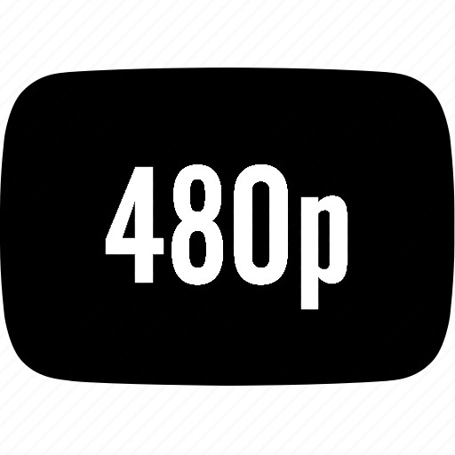
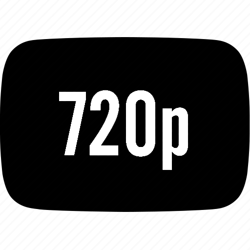

# Video Downloader

A Python application with a modern GUI interface. It is made for downloading videos mainly from YouTube and Instagram and save them as .mp4 files.

---

## Features


- **Pick Your Resolution**: Choose between 480p, 720p, or 1080p.
- **See Before You Download**: Preview the video thumbnail before downloading.
- **Track Progress**: Watch the download progress in real-time.
- **Simple to Use**: No confusing commands – just click buttons!
- **Video Processing**: Uses a powerful tool called <code>FFmpeg</code> (the program sets this up for you).
<div align="center">
    <!-- &nbsp;&nbsp;&nbsp;&nbsp;&nbsp;&nbsp; -->
    
    
    
</div>

## Supports
### Operating Systems
<div align="center">
    &nbsp;&nbsp;&nbsp;&nbsp;&nbsp;&nbsp;&nbsp;&nbsp;&nbsp;&nbsp;&nbsp;&nbsp;
    
</div>

### Platforms
<div align="center">
    &nbsp;&nbsp;&nbsp;&nbsp;&nbsp;&nbsp;&nbsp;&nbsp;&nbsp;&nbsp;&nbsp;&nbsp;
    
</div>

---

## Installation

### Prerequisites
1. **Python 3.8 or later**: Make sure Python is installed on your system. Download it from [Python.org](https://www.python.org/).
2. **Git** (optional): Install Git if you want to clone the repository directly.

### Steps to Install and Run:
1. Clone the repository or download it as a ZIP file:
    ```bash
    git clone https://github.com/yourusername/video-downloader.git
    cd video-downloader
    ```
   Or, download the ZIP file from the repository, extract it, and navigate to the folder.

2. Install the required dependencies:
    ```bash
    pip install -r requirements.txt
    ```

3. Run the application:
    ```bash
    python run.py
    ```

---

### Directory Structure
- `gui.py`  
    *Contains the main GUI logic using Tkinter; manages user interface and events.*
- `utils.py`  
    *Provides utility functions, including resetting the GUI and fetching video titles.*
- `video_downloader.py`  
    *Handles video downloading, thumbnail fetching, and ensuring FFmpeg availability.*
- `constants.py`  
    *Stores all constant values for styling, configuration, and application settings.*
- `run.py`  
    *Entry point for the application; calls the GUI's main function to start the app.*
- `requirements.txt`  
    *Lists all Python dependencies needed to run the application.*
- `assets/`
    - `icon.png`  
        *Stores the application's icon used in the GUI.*
- `README.md`  
    *Documentation for the project, including installation and usage instructions.*

---

## Troubleshooting
- **"FFmpeg not found" Error**: The program ensures `FFmpeg` is downloaded automatically. Check the `ffmpeg` directory in the project folder if issues persist.
- **Dependency Issues**: Ensure all dependencies are installed with `pip install -r requirements.txt`.
