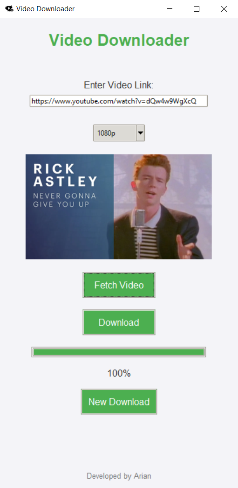
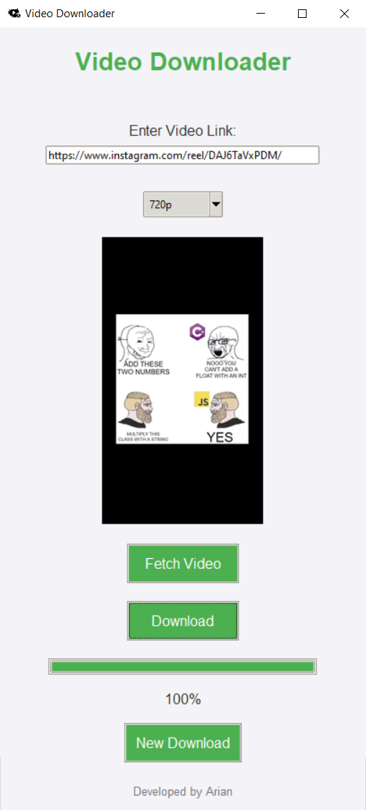

# Video Downloader
A Python application with a modern GUI interface. It is made for downloading videos mainly from YouTube and Instagram and save them as .mp4 files.

## Features
- **Pick Your Resolution**: Choose between 480p, 720p, or 1080p.
- **See Before You Download**: Preview the video thumbnail before downloading.
- **Track Progress**: Watch the download progress in real-time.
- **Simple to Use**: No confusing commands – just click buttons!
- **Video Processing**: Uses a powerful tool called <code>FFmpeg</code> (the program sets this up for you).

    <!-- &nbsp;&nbsp;&nbsp;&nbsp;&nbsp;&nbsp; -->
    
    
    

## Supports

### Operating Systems

    &nbsp;&nbsp;&nbsp;&nbsp;&nbsp;&nbsp;&nbsp;&nbsp;&nbsp;&nbsp;&nbsp;&nbsp;
    

### Platforms

    &nbsp;&nbsp;&nbsp;&nbsp;&nbsp;&nbsp;&nbsp;&nbsp;&nbsp;&nbsp;&nbsp;&nbsp;
    

## Instalation (Create Standalone Executable)

It is assumed that Python and pip are installed on your system.

Follow these steps to set up and run the **Video Downloader** on your computer:

1. Download the repository as a zip file and unzip it.
2. Open your terminal or command prompt and navigate to the password generator directory by typing `cd path/to/your/directory/video downloader-main`.
3. In the command prompt now type `pip install -r requirements.txt` to download the required packages.
4. Now you should type `pyinstaller --onefile --noconsole --add-data "assets/icon.png;assets" --add-data "assets/icon.ico;assets" --hidden-import "yt-dlp" --hidden-import "requests" --hidden-import "pillow" --icon "assets/icon.ico" --distpath . "Video Downloader.py" & rmdir /s /q build & del "Video Downloader.spec"` to install the Video Downloader as a standalone executable.
4. Now the Video Downloader.exe file should be in video-downloader-main and you can run it.

## Screenshots

    &nbsp;&nbsp;&nbsp;&nbsp;&nbsp;&nbsp;&nbsp;&nbsp;&nbsp;&nbsp;&nbsp;&nbsp;
    

## Directory Structure
- **Video Downloader.py**: Entry point for the application; calls the GUI's main function to start the app.
- **gui.py**: Contains the main GUI logic using Tkinter; manages user interface and events.
- **utils.py**: Provides utility functions, including resetting the GUI and fetching video titles.
- **video_downloader.py**: Handles video downloading, thumbnail fetching, and ensuring FFmpeg availability.
- **constants.py**: Stores all constant values for styling, configuration, and application settings.
- **requirements.txt**: Lists all Python dependencies needed to run the application.
- **assets/**: Stores the application's icon used in the GUI.
- **README.md**: Documentation for the project, including installation and usage instructions.

## Troubleshooting
- **"FFmpeg not found" Error**: The program ensures `FFmpeg` is downloaded automatically. Check the `ffmpeg` directory in the project folder if issues persist.
- **Dependency Issues**: Ensure all dependencies are installed with `pip install -r requirements.txt`.
